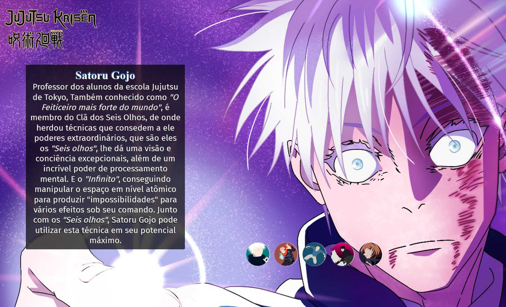

<h1 align="center">PageAnime - Jujutsu Kaisen</h1>

 

  <a href="#-tecnologias">Tecnologias</a>&nbsp;&nbsp;&nbsp;|&nbsp;&nbsp;&nbsp;
  <a href="#-projeto">Projeto</a>&nbsp;&nbsp;&nbsp;|&nbsp;&nbsp;&nbsp;

 

  

## 🚀 Tecnologias

Esse projeto foi desenvolvido com as seguintes tecnologias:

- HTML, CSS e JavaScript
- Git e Github

## 💻 Projeto

O projeto consiste em uma página com tela de um anime, escolhido por mim, com a descrição de alguns personagens.
Possui certa responsividade, mudando a imagem de fundo e se reajustando a tela, dependendo do aparelho acessado.

- [Visit the project online](https://rafael-vitor-oliveira.github.io/PageAnime/)